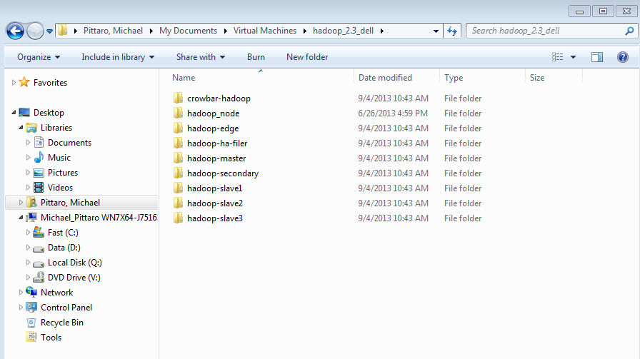

# VMWare utility scripts 

These are scripts to automate some VM management tasks I’m continually
doing under Windows.  These are shell scripts that run under cygwin, and
they use the VMWare ‘vmrun’ utility behind the scenes to do the work.

My VM’s are split across directories on two disks – C:
is an SSD, D: is a real disk drive.  The directories are
C:/Users/NT_USER/Documents/Virtual Machines and
D:/Documents/Virtual Machines

I have VM’s there, and I also have directories of VM’s for OpenStack
and Hadoop that I call ‘environments’

*activate_env* is a fancy wrapper around a file move, that takes a
directory from D: and moves it  to C:, checking for available space.
The single argument is the name of an environment, which is just the
directory below ‘Virtual Machines’.

*archive_env* does the opposite – it moves from C: to D:.  I use a
symlink for the two names, you can also just save a copy of the script
with the second name:

    $ ls -l
    total 27
    -rwxr-xr-x 1 nt_user mkgroup 1801 Jul 13 01:01 activate_env
    lrwxrwxrwx 1 nt_user mkgroup   12 Jul 13 00:57 archive_env -> activate_env
    -rwxr-xr-x 1 nt_user mkgroup 1711 Jul 12 23:02 clone_hadoop

Usage is simple.    Heres what one of my hadoop setups looks like:

 

`archive_env hadoop_2.3_dell` will move all these VMs’ to my D: drive.
`activate_env hadoop_2.3_dell` will move them all to the C: drive.

    nt_user@WINBOX ~/bin
    $ archive_env hadoop_2.3_dell
    `C:/Users/NT_USER/Documents/Virtual Machines/hadoop_2.3_dell' -> `D:/Documents/Virtual Machines/hadoop_2.3_dell'
    `C:/Users/NT_USER/Documents/Virtual Machines/hadoop_2.3_dell/crowbar-hadoop' -> `D:/Documents/Virtual Machines/hadoop_2.3_dell/crowbar-hadoop'
    `C:/Users/NT_USER/Documents/Virtual Machines/hadoop_2.3_dell/crowbar-hadoop/crowbar-hadoop-000001.vmdk' -> `D:/Documents/Virtual Machines/hadoop_2.3_dell/crowbar-hadoop/crowbar-hadoop-000001.vmdk'
    `C:/Users/NT_USER/Documents/Virtual Machines/hadoop_2.3_dell/crowbar-hadoop/crowbar-hadoop-000002.vmdk' -> `D:/Documents/Virtual Machines/hadoop_2.3_dell/crowbar-hadoop/crowbar-hadoop-000002.vmdk'
    .....
    removed directory: `C:/Users/NT_USER/Documents/Virtual Machines/hadoop_2.3_dell'
    nt_user@WINBOX ~/bin

you can also use archive_env and activate_env to move a single VM in the virtual machines directory back and forth.

*clone_hadoop* is a script I wrote to setup a new hadoop environment.
I have some template VM’s on my D: drive in D:\Documents\Virtual Machines\Templates 
These are new, empty VM’s with networks and hard
drives connected for openstack and hadoop.   The script has a loop that
creates multiple clones of the template VM into an environment directory
on C:  Right now, it creates an edge node, two name nodes, and HA node,
and three slaves.    You can tweak the names in the script, and it would
be easy to create an openstack version.    The script does not create
or clone a crowbar admin node – I usually do that by hand.  

My typical use for clone_hadoop  is to setup up a new environment, or to
blow away all the VM’s in an anvironment in C: except my admin node,
and then use clone_hadoop to create new nodes to deploy on.

    nt_user@WINBOX ~/bin
    $ ls /cygdrive/d/Documents/Virtual\ Machines/Templates/
    hadoop_node  openstack_node
    nt_user@WINBOX ~/bin
    $ ls /cygdrive/c/Users/NT_USER/My\ Documents/Virtual\ Machines/hadoop_2.4/

    nt_user@WINBOX ~/bin
    $ clone_hadoop hadoop_2.4
    Cloning vms into  c://Users/NT_USER/Documents/Virtual Machines/hadoop_2.4
    Cloning  hadoop-master
    Cloning  hadoop-secondary
    Cloning  hadoop-ha
    Cloning  hadop-edge
    Cloning  hadoop-data1
    Cloning  hadoop-data2
    Cloning  hadoop-data3

    nt_user@WINBOX ~/bin
    $ ls /cygdrive/c/Users/NT_USER/My\ Documents/Virtual\ Machines/hadoop_2.4/
    hadoop-data1  hadoop-data2  hadoop-data3  hadoop-ha  hadoop-master  hadoop-secondary  hadop-edge

After you have opened these VM’s in vmware once, the entries will stay
there.  The files behind the scenes will change, but you won’t have
to re-open them in vmware again  The scripts don’t check for running
vm’s, so shut everything down first.  I usually restart VMware after
shuffling things around.

Also, vmware seems to re-use the same mac addresses for the same vm’s
each time, which has been useful.

